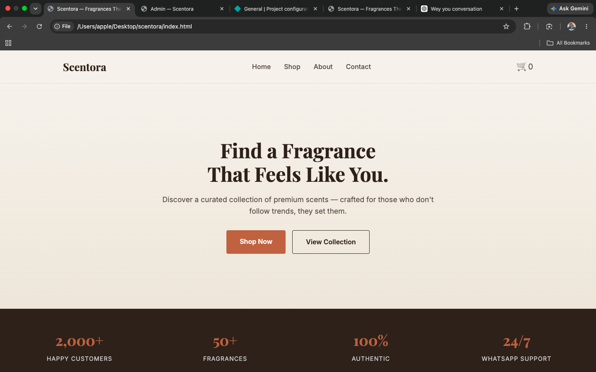
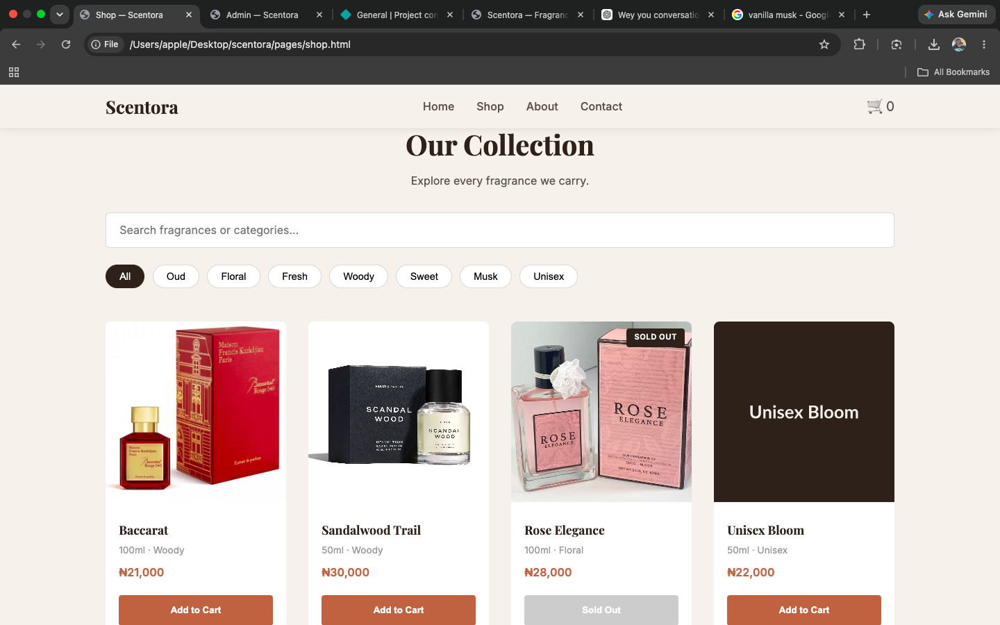
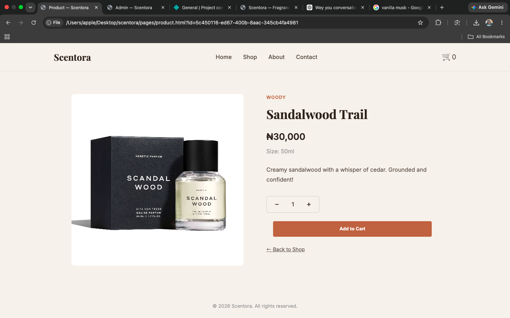
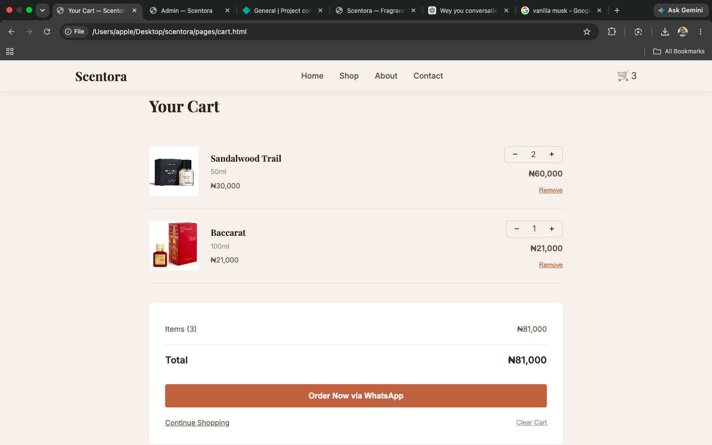
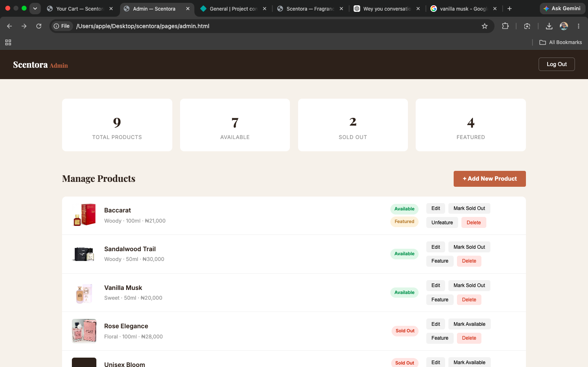
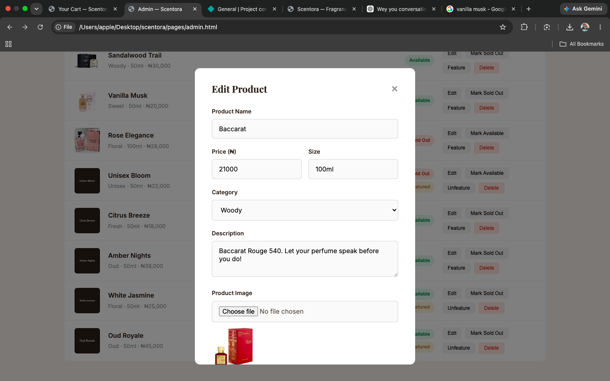

# Scentora — Perfume E-Commerce Demo Store

A fully functional, mobile-first perfume e-commerce demo built with vanilla HTML, CSS, and JavaScript — powered by Supabase for the database, authentication, and image storage. No frameworks, no build tools — just clean, readable code from scratch.

🔗 **Live Demo:** [scentorae.netlify.app](https://scentorae.netlify.app)

## 📸 Screenshots

### Customer Experience

| Homepage | Shop |
|---|---|
|  |  |

| Product Details | Shopping Cart |
|---|---|
|  |  |

### Admin Dashboard

| Dashboard | Add/Edit Product |
|---|---|
|  |  |

### Checkout

## Features

### Customer Experience

- Responsive, animated homepage with scroll-reveal effects
- Full product catalogue with category filtering and live search
- Individual product detail pages with quantity selection
- Persistent shopping cart (localStorage-backed — survives browser close/reopen)
- One-click WhatsApp checkout — generates a formatted order message and opens WhatsApp automatically, no payment gateway needed

### Admin Dashboard

- Secure login via Supabase Authentication
- Live dashboard stats (total, available, sold out, featured products)
- Full product management — add, edit, delete
- Image upload directly to Supabase Storage
- Toggle product availability and featured status
- All changes reflect instantly on the public site

## Tech Stack

- **Frontend:** HTML5, CSS3 (Grid, Flexbox, CSS variables), Vanilla JavaScript (ES6+)
- **Backend:** Supabase (PostgreSQL database, Authentication, Storage)
- **Hosting:** Netlify (continuous deployment from GitHub)
- **Security:** Row Level Security (RLS) policies — public read access, authenticated-only writes

## Why No Framework?

This project deliberately avoids React/Vue/build tools to demonstrate strong fundamentals — real DOM manipulation, state management via plain JavaScript, and a clean understanding of how the browser, database, and auth layer actually communicate under the hood.

## Project Structure

\`\`\`
scentora/
├── index.html
├── pages/
│ ├── shop.html
│ ├── product.html
│ ├── cart.html
│ └── admin.html
├── css/
│ ├── style.css
│ └── responsive.css
├── js/
│ ├── config.js
│ ├── supabase.js
│ ├── products.js
│ ├── cart.js
│ ├── whatsapp.js
│ ├── auth.js
│ ├── admin.js
│ └── ui.js
└── README.md
\`\`\`

## Local Setup

1. Clone the repo
2. Create a [Supabase](https://supabase.com) project
3. Set up the \`products\` table and \`product-images\` storage bucket (see schema below)
4. Add your Supabase URL and publishable key to \`js/config.js\`
5. Open \`index.html\` in a browser — no build step required

## Database Schema

\`\`\`sql
create table products (
id uuid primary key default gen_random_uuid(),
name text not null,
price numeric not null,
description text,
image_url text,
size text,
category text not null,
available boolean default true,
featured boolean default false,
created_at timestamptz default now(),
updated_at timestamptz default now()
);
\`\`\`

## Future Upgrades

- Online payment integration (Paystack/Flutterwave)
- Order management dashboard
- Real inventory tracking
- Customer reviews
- Discount codes

---

Built by [Khaleed Olawale](https://github.com/khaleedolawale)
